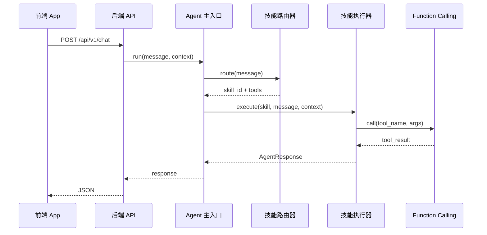

# 架构说明

## 分层职责

### 1. 前端 App (`frontend/`)

- 采集用户输入（语音/文本）
- 调用后端 `POST /api/v1/chat`
- 渲染 Agent 返回的结构化结果（文本、导航指令、控制状态等）

### 2. 后端 API (`backend/`)

- 对外 HTTP 网关，鉴权、限流、日志（后续可扩展）
- 将请求转交给 Agent 主入口，不承载具体技能逻辑

### 3. Agent 主入口 (`agent/main.py`)

- 统一会话上下文（`session_id`、`context`）
- 编排：路由 → 执行 → 汇总响应

### 4. 技能路由器 (`agent/router.py`)

- 启动时扫描 `skills/**/SKILL.md`
- 根据 `triggers`（关键词/意图）匹配技能
- 输出：`skill_id`、置信度、所需工具列表

### 5. 技能执行器 (`agent/executor.py`)

- 按 SKILL 配置调用 `tools/` 中的 Function
- 将工具结果组装为前端可消费的 `AgentResponse`

### 6. Function Calling (`tools/`)

- `registry.py`：工具注册表（名称 → 可调用函数）
- `points.py`：获取地图/设备点位
- `cloud_api.py`：调用云端业务接口（占位）

## 数据流（一次请求）

## 扩展原则

- **技能与代码解耦**：新能力优先只加 `SKILL.md` + 工具函数，不改路由核心
- **工具可复用**：多个技能可共享同一 Function（如 `get_points`）
- **后端薄、Agent 厚**：业务编排集中在 `agent/`，API 层保持简单
